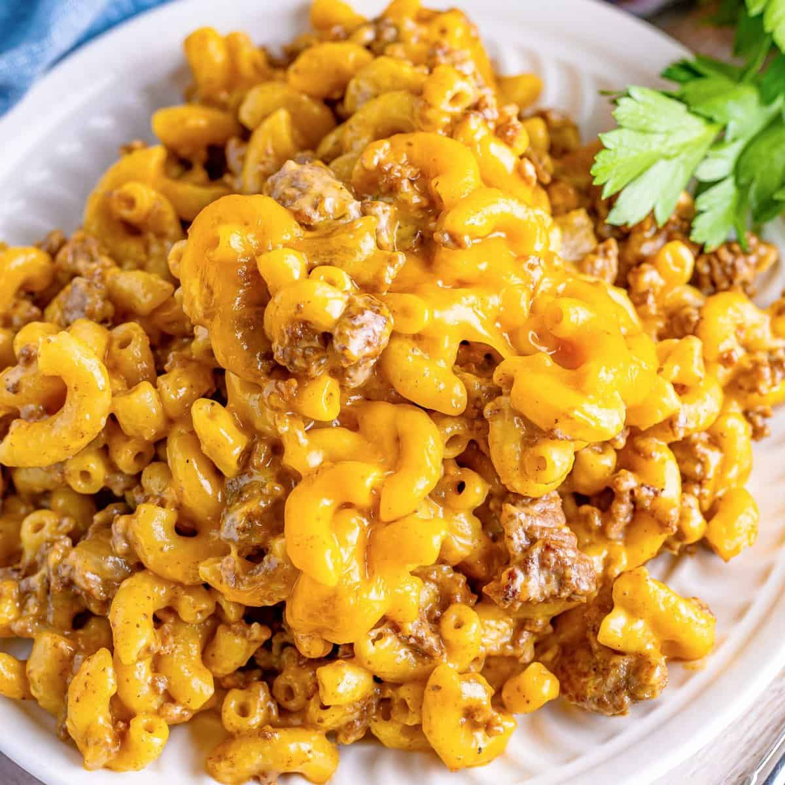

# Cheeseburger Macaroni

- 2 pounds ground beef
- 1 small onion, finely diced
- 4 cups beef stock
- 10.5 ounce can cream of mushroom soup
- 1 teaspoon black pepper
- 1 teaspoon garlic powder
- 1 teaspoon onion powder
- 1 teaspoon paprika
- 16 ounces uncooked elbow macaroni
- 6-8 slices of Colby Jack cheese (or American or Cheddar), cut/torn into small pieces
- 4-6 slices of Pepperjack cheese, cut/torn into small pieces

1. In a large skillet over medium-high heat, add 2 pounds ground beef and break it up into crumbles. Cook until there is no pink left, about 10 minutes.
2. Drain excess grease and add the ground beef to the bottom of an slow cooker.
3. Add the onion, beef stock, cream of mushroom soup (un-diluted), black pepper, garlic powder, onion powder, and paprika to the slow cooker. Stir to combine.
4. Cover and turn the slow cooker on low heat for 4-6 hours or high for 2-4 hours. Stir every hour or so if you can.
5. Add 16 ounces uncooked elbow macaroni and stir to combine. Continue to cook for 20-30 minutes, stirring every 10 minutes until the noodles are fully cooked.
6. Add the cheeses and stir it in.
7. Place the top back on the pot and wait 5 minutes. Stir until all of the cheese is melted.
8. Serve and enjoy!