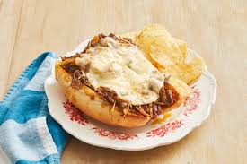

# Drip Beef Sandwiches

- 1 (2 1/2-lb.) piece beef chuck roast
- 1 tsp. minced fresh rosemary
- 3/4 tsp. kosher salt
- Black pepper, to taste
- 1 (12-oz.) jar pepperoncini
- 1 c. beef broth
- 6 tbsp. salted butter, softened
- 2 tbsp. olive oil
- 1 large onion, sliced
- 6 soft hoagie rolls, split
- 12 slices provolone cheese

Note: This version of the recipe is a combination of the versions listed on ThePioneerWoman's website and the version she posted to foodnetwork.com. The steps are mostly left untouched, I've just added some notes and tips based on my experience.

1. Toss the beef roast in a 6-8 quart slow cooker with the rosemary, ½ teaspoon salt and a generous grinding of pepper.
2. Add the pepperoncini with their brine, along with the beef broth. Cover and cook on low until the meat is very tender and easy to pull apart, 7 to 8 hours.
- Remove the stems and tops from the pepperoncini first. They fall off during cooking, so I had to fish them out in the end, which is difficult when the meat gets very tender.
1. When the slow cooker has about 15 minutes left, heat 2 tablespoons butter and 2 tablespoons of olive oil in a large skillet over medium-high heat.
2. Add the onion, the remaining 1/4 teaspoon salt and a few grinds of pepper. Cook, stirring occasionally, until tender and lightly browned, about 10 minutes.
- 10 minutes is a little optimistic. I cooked mine for about 20 minutes, and they were still not as caramelized as I would have liked, but as long as you get them tender and browned, they will be delicious on the sandwiches.
1. Remove the roast to a bowl and shred using 2 forks, then return it to the slow cooker. Keep warm. 
- I used a hand mixer on the lowest setting to shred the meat, which worked great and was much faster than using forks
- The recipe doesn't specify, but I kept the juices in the slow cooker when I returned the meat.
- Also, just keep the meat in the slow cooker until the onions are done. If you shred it at 7 hours like I did, the warming step will finish the cooking by time the onions are done.
1. Preheat the broiler.
- The broiler is pretty intense. Just keep an eye on the rolls or set your oven to a lower temperature if you can. They can go from toasted to burnt in a matter of seconds.
1. Put the rolls on a baking sheet and spread with the remaining 4 tablespoons butter. Broil until toasted, about 2 minutes.
2. Heap a generous portion of meat on each roll, then spoon some of the cooking liquid over the meat. Top with a few pepperoncini from the slow cooker and plenty of caramelized onions. 
- If you kept the juices in the slow cooker, just use a slotted spoon to get the meat out and drain the excess from the meat.
1.  Put 2 slices of cheese on each sandwich and return to the broiler just to melt the cheese, about 1 more minute. 
- I found that the cheese melted pretty well just by putting the sandwiches together and letting the residual heat from the meat do the work, so I skipped this step.)
