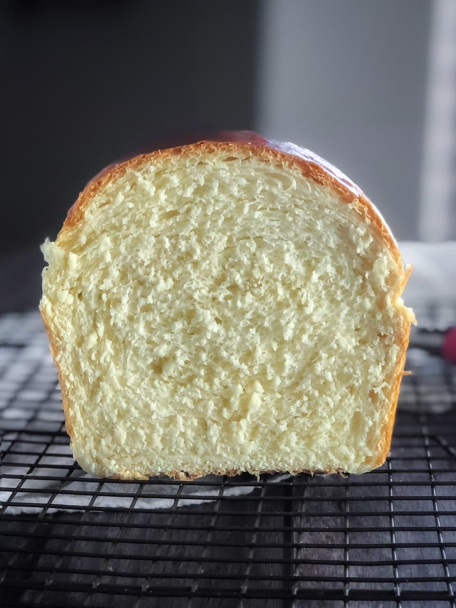

# Honey White Bread

- 2 cups milk, warm
- 1 tablespoon instant yeast
- 1 teaspoon sugar
- 5.5-6.5 cups flour
- 1/4 cup butter, melted
- 1/4 cup honey
- 1 egg, beaten
- 1 tablespoon salt

1. Put the milk in your mixer bowl and sprinkle the yeast and sugar over it. Mix together and let sit for 5 minutes to make sure the yeast activates and gets foamy.
2. Add 5-1/2 cups of the flour, the melted butter, honey, egg and salt.
3. Use the dough hook attachment to mix the dough together on low speed.
4. Add small amounts of bread flour, up to one cup extra, until the dough is tacky but not sticky.
5. Let the mixer knead the bread on low speed for 5 minutes.
6. Scrape the dough in to a ball, place in a large oiled bowl, cover the bowl with plastic wrap or a damp towel, letting it rise for approximately 1 hour, or until doubled in size. While waiting, grease two 9x5 inch loaf pans.
7. Punch down the dough and turn it out onto a lightly floured surface. Divide the dough in half and shape each half into a log.
8. Cover the loaves with a towel and let rise for another 30-45 minutes, until doubled in size.
9. Preheat the oven to 350°F.
10. Bake the loaves for 30-35 minutes, until golden brown on top and hollow-sounding when tapped.
11. Remove the loaves from the pans and let cool on a wire rack for at least 30 minutes before slicing. Enjoy!